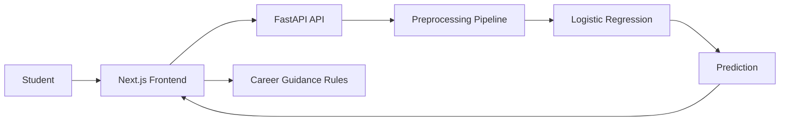

# Placify

**Student Placement Prediction & Career Guidance**

 _Your Career Starts With Understanding Your Profile._

Placify is a full-stack machine-learning web application that predicts placement classification (**Placed** or **NotPlaced**) from student profile inputs and provides transparent, educational guidance.

---

## 1. Overview

Placify combines:
- A reproducible ML training pipeline (Python + scikit-learn)
- A FastAPI inference backend
- A modern responsive Next.js frontend
- Educational model transparency (accuracy, precision, recall, F1, confusion matrix)

---

## 2. Problem Statement

Students often struggle to understand how academic performance, skills development, and preparation factors relate to historical placement outcomes.

---

## 3. Features

- Logistic Regression binary classification
- Real preprocessing pipeline inside model artifact
- `/predict` API with validated schema
- Model metrics and confusion matrix endpoints
- Multi-step student profile form
- Prediction result + model probability for predicted class
- Rule-based suggested focus areas (max 3)
- How It Works, Insights, and About pages

---

## 4. Dataset

Expected input file: `placementdata.csv` at project root.

The training script validates required columns and fails fast if the schema does not match.

---

## 5. Dataset Features

Predictive features:
- CGPA
- Internships
- Projects
- Workshops/Certifications
- AptitudeTestScore
- SoftSkillsRating
- ExtracurricularActivities
- PlacementTraining
- SSC_Marks
- HSC_Marks

Target:
- PlacementStatus

Ignored identifier:
- StudentID

---

## 6. Machine Learning Approach

- Problem Type: Binary Classification
- Primary Algorithm: Logistic Regression
- Train/Test Split: 80/20, stratified
- Random State: 42

---

## 7. Preprocessing

A single sklearn `Pipeline` is saved, containing:

- Numerical transformer: `StandardScaler`
- Categorical transformer: `OneHotEncoder(handle_unknown="ignore")`
- Classifier: `LogisticRegression(random_state=42, max_iter=1000)`

This guarantees training/inference consistency.

---

## 8. Logistic Regression

Implemented as the primary and only classification model in this version.

---

## 9. Evaluation

Computed on held-out test set only:
- Accuracy
- Precision
- Recall
- F1-score
- Confusion Matrix
- Classification Report

Saved under `backend/model/evaluation.json`.

---

## 10. Architecture



---

## 11. Tech Stack

- Frontend: Next.js (App Router), React, Tailwind CSS, Framer Motion, Lucide icons
- Backend: FastAPI, Pydantic
- ML: Pandas, NumPy, scikit-learn, joblib
- Database baseline: PostgreSQL + Drizzle (existing project health route)

---

## 12. Project Structure

- `src/app/*` Next.js routes and pages
- `src/components/*` reusable UI modules
- `src/lib/api.ts` frontend API layer
- `backend/train_model.py` ML training pipeline
- `backend/main.py` FastAPI app
- `backend/services/*` predictor and guidance logic
- `backend/schemas/*` Pydantic schemas
- `backend/tests/*` API tests

---

## 13. Local Setup

```bash
npm install
cp .env.example .env.local
```

Set:
- `NEXT_PUBLIC_API_URL=http://localhost:8000`

---

## 14. Backend Setup

```bash
cd backend
python -m venv .venv
source .venv/bin/activate
pip install -r requirements.txt
```

---

## 15. Frontend Setup

```bash
npm run dev
```

---

## 16. Environment Variables

### Frontend
- `NEXT_PUBLIC_API_URL` (FastAPI base URL)

### Backend
- `FRONTEND_URL` (allowed production frontend origin for CORS)

### Existing Next healthcheck
- `DATABASE_URL`

---

## 17. API Endpoints

- `GET /health`
- `GET /model-info`
- `GET /model-evaluation`
- `POST /predict`

---

## 18. Model Training

From project root:

```bash
python backend/train_model.py
```

Outputs:
- `backend/model/placement_model.joblib`
- `backend/model/model_metadata.json`
- `backend/model/evaluation.json`

---

## 19. Deployment

Recommended:
- Frontend on Vercel
- Backend on Render

---

## 20. Vercel

1. Connect repository
2. Framework: Next.js
3. Add env var: `NEXT_PUBLIC_API_URL=https://<your-render-service>.onrender.com`
4. Deploy

---

## 21. Render

1. Create a Web Service from repository
2. Root directory: `backend`
3. Build command: `pip install -r requirements.txt`
4. Start command: `uvicorn main:app --host 0.0.0.0 --port $PORT`
5. Add env var: `FRONTEND_URL=https://<your-vercel-domain>`
6. Ensure trained artifacts exist in `backend/model/`

---

## 22. Limitations

- Historical data may not represent all student populations.
- Test accuracy does not guarantee real-world hiring outcomes.
- Predictions are educational and should not be used for high-stakes decisions.

---

## 23. Disclaimer

This is an educational machine-learning project. Predictions are based on patterns learned from the provided historical dataset and should not be treated as a guarantee of employment or as professional career advice.

Model accuracy is measured on a held-out test dataset and does not guarantee the same performance on future students or real-world hiring outcomes.

---

## 24. Future Improvements

- Resume analysis
- Skill-gap analysis
- Job-role recommendations
- Prediction history
- PDF career report
- SHAP explainability
- Model comparison
- Additional datasets
